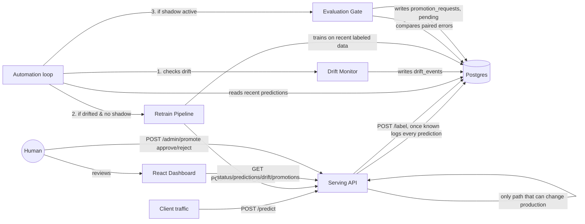

# Drift-Watchdog

A self-healing MLOps pipeline: it serves a live model, detects when the
model's world has changed (data drift), automatically retrains and shadow-
tests a replacement against real traffic, and asks a human to approve
before that replacement ever serves a live prediction.

**Core rule the whole system is built around: nothing gets promoted to
production without a human clicking approve.** Every automatic step
(retraining, shadow deployment, statistical evaluation) is designed to be
safe to run unattended precisely because none of it can flip that switch.

## Why this exists

Models decay silently. A delivery-time model trained on last year's traffic
patterns quietly gets worse when monsoon season changes travel times — not
with an error, just a slow drift into wrong answers, usually discovered
weeks later via complaints. This project is a small, working version of the
system that catches that early: it watches the model's real input data for
statistically significant drift, and when it finds it, builds and proves a
replacement automatically — without ever being trusted to make the final
call itself.

## Architecture



## The five pieces

| Component | What it does | Where |
|---|---|---|
| **Serving API** | Serves predictions from the current production model, logs every prediction (and shadow prediction, if one exists), accepts true labels once known | `serving/app.py` |
| **Drift Monitor** | KS-test comparing recent live input features against the original training distribution; flags drift when 2+ features shift significantly | `monitor/drift_monitor.py` |
| **Retrain Pipeline** | Trains a challenger on recent *labeled* live data (not the stale original set) and deploys it to shadow — visible in every prediction's logs, never served to a real caller | `retrain/retrain_pipeline.py` |
| **Evaluation Gate** | Pairs production's and the challenger's predictions on the same real requests, runs a Wilcoxon signed-rank test on their errors, and only creates a promotion request if the improvement is real and statistically significant | `evaluation/evaluation_gate.py` |
| **Automation Loop** | Runs the above three on a schedule, holding off retraining again while a challenger is already awaiting evaluation | `automation/loop.py` |
| **Dashboard** | Plain, flat React UI: model status, drift history, recent predictions, and the *only* place a human clicks approve/reject | `dashboard/` |

## Human approval — the one thing automation can never do

`POST /admin/promote` in `serving/app.py` is the single code path capable of
changing which model serves production traffic. It requires an existing
promotion request (which only the evaluation gate can create, and only
after a statistical test passes) and an explicit `approve` or `reject`
decision. The automation loop never calls it. There is no scheduled job,
no auto-approval threshold, no timeout that promotes a model on its own.

## Data

Uses the real **Kaggle House Prices — Advanced Regression Techniques**
dataset (`data/house_prices_raw.csv`, 1460 homes, 80 raw features), not
synthetic data. The model and preprocessing pipeline are lifted directly
from the user's own `housing.ipynb` notebook:

- **Preprocessing** (`data/house_price_preprocessor.py`): a proper fit/
  transform object reproducing the notebook's exact steps — "None" fills
  for features a house genuinely doesn't have, neighborhood-median
  `LotFrontage` imputation, ordinal encoding for 10 quality columns, one-
  hot encoding for the rest, with column alignment for anything scored
  later. Fit once on training data and saved alongside each model version
  (`preprocessor_v1.joblib`, etc.) so serving and retraining always apply
  an identical transform.
- **Model**: the user's own tuned `GradientBoostingRegressor`
  (`n_estimators=1500, learning_rate=0.05, max_depth=3, min_samples_leaf=2,
  min_samples_split=5, loss="huber"`), trained on `log1p(SalePrice)` — the
  best of everything tried in the notebook (Linear Regression, Ridge,
  Random Forest, untuned GB), at roughly 0.122 cross-validated log RMSE.

**Drift is still simulated**, per an earlier decision: this dataset has no
time axis, so `data/generate_dataset.py` splits the 1460 rows into a
training set and a "stream," then injects a genuine distribution shift
partway through the stream — `OverallQual` and `GrLivArea` pushed up,
`YearRemodAdd` nudged later — simulating a renovation/luxury wave in the
input data, in real feature columns, not synthetic noise.

**Drift monitoring** deliberately checks a **curated set of raw columns**
(`OverallQual`, `GrLivArea`, `YearBuilt`, `TotalBsmtSF`, etc.) rather than
the ~200 one-hot dummy columns the model actually trains on — running a
KS-test on a 0/1 dummy column is close to meaningless. This was flagged as
a design decision before building it, not decided silently.

**A known tradeoff, stated plainly**: training data here is roughly 876
rows (60% of the dataset, the rest held out for the stream), so the
baseline model's real Log RMSE is ~0.142 — noticeably worse than the
notebook's ~0.122, which trained on the full dataset. This is the honest
cost of having genuinely held-out data to simulate drift against, not a
bug. Training on the full dataset instead (closer to the notebook's exact
number) is a one-line change if preferred — ask, and it flips.

One real bug worth knowing about, found while building the earlier
synthetic-data version: calling `sklearn.make_regression` twice with
different seeds produces two *unrelated* regression problems, not two
samples of the same one, since the seed also controls the generated
coefficients. Fixed by generating one combined dataset and splitting rows
afterward — a pattern this project's real-data generator follows too
(split rows from ONE dataset, don't regenerate).

## Running it

### Locally (SQLite, no setup)
```bash
pip install -r requirements.txt
python -m data.generate_dataset
python -m models.train_baseline
uvicorn serving.app:app --reload --port 8000          # terminal 1
python simulator/stream_simulator.py --speed 0.02      # terminal 2
```

### With Postgres + full automation, via Docker Compose
```bash
docker compose up --build
```
This starts Postgres, the serving API, the automation loop (checking every
60s by default), and the dashboard at `http://localhost:5173`.

> **Honest note on the Compose setup**: the Postgres connection, the
> serving/retrain/monitor/gate code, and the automation loop have all been
> tested directly against a real Postgres instance and proven to work end
> to end. The `docker-compose.yml` and Dockerfiles themselves were written
> carefully but not run through Docker in the environment this was built
> in (no Docker available there). Run `docker compose up --build` yourself
> and report back anything that needs fixing.

### The dashboard on its own
```bash
cd dashboard
npm install
npm run dev
```
Needs the serving API running at `localhost:8000` to show anything real.

## What's genuinely tested vs. what to verify yourself

**Tested end-to-end, with real data, more than once:**
- Serving + logging (SQLite and Postgres)
- Drift monitor correctly staying quiet on clean data and firing on
  genuinely drifted data, identifying the exact drifted features
- Retrain pipeline producing a real challenger model from live traffic
- Shadow deployment — confirmed via logs that both models get scored,
  only production's answer is ever returned
- Evaluation gate — confirmed it passes on a real improvement (p≈0),
  and correctly refuses when a challenger isn't meaningfully better
- Human approval and rejection — confirmed production only changes on
  approve, and stays put (with the challenger still in shadow) on reject
- The full automation loop, unattended: detected drift, retrained,
  deployed to shadow, held off retraining again while shadow was active,
  and reached a promotion request once enough evidence existed — never
  touching production itself

**Not run in this environment, worth verifying yourself:**
- `docker compose up --build` end to end
- The dashboard rendered in an actual browser (verified it compiles and
  fetches real data correctly, but never visually inspected the pixels)

## AI-generated explanations (optional)

`llm/explain.py` calls Claude (Haiku — a fast, inexpensive model, appropriate
for short summaries of numbers the pipeline already computed) to generate
plain-English explanations:
- **Why drift was detected** — shown when you click a "drift detected" row
  in the dashboard's Drift monitor checks table
- **Why a promotion is recommended** — shown directly on each pending
  promotion request card, next to Approve/Reject

**This is additive, never load-bearing.** Every number in these
explanations comes from statistics the pipeline already computed (KS
scores, MAE, p-values) — Claude is only asked to phrase them in plain
English, never to invent its own analysis. If `GROQ_API_KEY` isn't
set, or the API call fails for any reason, the system falls back to a
deterministic, template-built explanation instead of breaking anything.
Drift detection, retraining, the evaluation gate, and human approval all
work identically whether or not this key is set.

**To enable real Claude-generated explanations**: copy `.env.example` to
`.env` in the project root and set `GROQ_API_KEY` — Docker Compose
picks it up automatically. Running locally without Docker, just export it
in your shell before running the monitor/gate/automation loop.

**One-time note if you already have a running Postgres volume from before this
feature**: this update adds new `explanation` columns to `drift_events` and
`promotion_requests`. This project doesn't use migrations (no Alembic), so
an existing database won't get the new columns automatically. Reset it once
with `docker compose down -v` (the `-v` wipes the Postgres volume) before
`docker compose up --build` again — you'll need to re-run
`python -m models.train_baseline` too, since that also wipes `model_v1`.

## Next steps, not yet built
- Swap in a real dataset (yours, or a live-changing public one)
- Prometheus/Grafana for infra-level monitoring (optional, from the
  original plan)
- A small LLM call to auto-generate a plain-English "why drift was
  detected" note next to each promotion request (nice-to-have)
